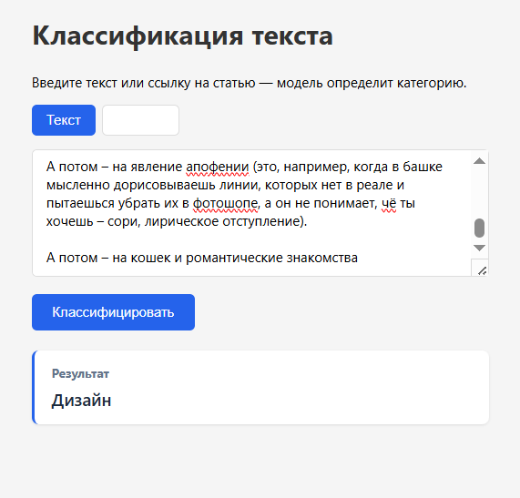
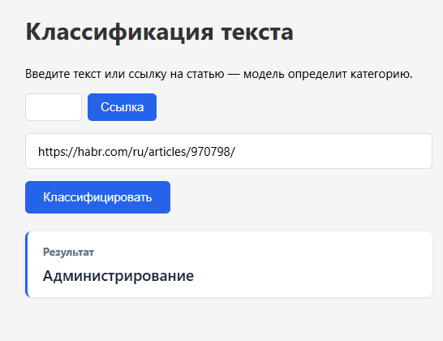

# Text Classification

Классификация текста и статей 

## Структура проекта

```
text-classification/                       
│
├── docker-compose.yml                  
├── requirements.txt                     
│
├── alembic/                     # Папка с миграциями БД
│   ├── env.py                             
│   ├── script.py.mako                     
│   └── versions/                          
│
├── app/                         # Основная папка бэкенда
│   ├── __init__.py             
│   ├── main.py                  
│   ├── config.py                             
│   ├── database.py                             
│   ├── Dockerfile                               
│   │
│   ├── api/                                     
│   │   ├── __init__.py
│   │   └── predict.py                             
│   │
│   ├── models/                                  
│   │   ├── __init__.py
│   │   └── article.py                              
│   │
│   ├── schemas/                                 
│   │   └── predict.py                              
│   │
│   ├── services/                              
│   │   ├── __init__.py
│   │   ├── inference.py                            
│   │   └── parser.py                                
│   │
│   └── crud/                                     
│       ├── __init__.py
│       └── article.py                              
│
└── frontend/                                   
    ├── index.html                                
    ├── css/                                      
    │   └── style.css
    └── js/                                        
        └── script.js                                
```


## API

- `POST /predict/text`


- `POST /predict/url` 


