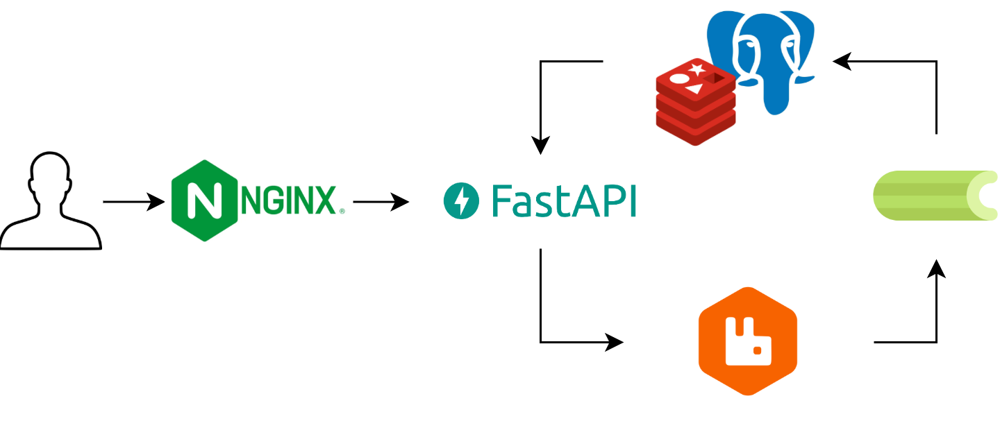
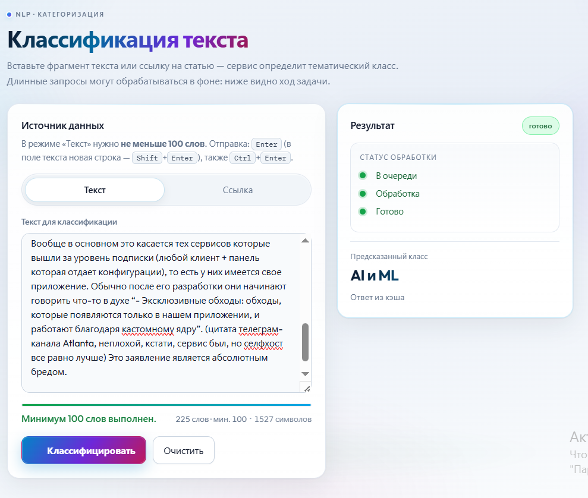

# Классификация текста и статей 

## Описание 
Сервис автоматической классификации текстов (статей) по 10 тематическим категориям на основе дообученной модели **ruModernBERT**.
Сервис принимает текст или ссылку на статью, асинхронно обрабатывает запрос и возвращает предсказанный класс. Поддерживаются русскоязычные тексты.

## Архитектура:
- FastAPI — API
- Celery + RabbitMQ — очередь задач
- Redis — кэширование
- PostgreSQL — хранение статусов задач
- Nginx — статика и reverse proxy
- Docker — контейнеризация



## Технологии

- **Backend:** FastAPI 
- **ML:** PyTorch, Hugging Face Transformers (ruModernBERT)
- **Очереди:** Celery, RabbitMQ
- **Базы данных:** PostgreSQL, Redis
- **Веб-сервер:** Nginx
- **Контейнеризация:** Docker, Docker Compose
- **Парсинг:** aiohttp, BeautifulSoup4

## 🚀 Быстрый старт
### 1. Клонирование репозитория

```bash
git clone https://github.com/lmalborought/Diplom.git
cd Diplom
```
### 2. Скачайте модель по ссылке https://disk.yandex.ru/d/Qd5ezbkaU2_SiQ

### 3. Поместите скачанный файл model_weights.pt в корень проекта

### 4. Создайте файл .env в корне проекта:
   ```bash
# .env
DB_USER=postgres
DB_PASSWORD=your_password
DB_HOST=db
DB_PORT=5432
DB_NAME=app

DATABASE_URL=postgresql://${DB_USER}:${DB_PASSWORD}@${DB_HOST}:${DB_PORT}/${DB_NAME}

DEBUG=False

HF_TOKEN=your_huggingface_token_here

REDIS_URL=redis://redis:6379/0
   ```
- Замените your_password на надежный пароль, а your_huggingface_token_here — на ваш личный токен HuggingFace
  
### 5. Запустить
```bash
docker-compose up -d --build
```
## Интерфейс
### Ввод текста


### Ввод ссылки


## API
- POST /api/predict/text — классификация текста

- POST /api/predict/url — классификация статьи по ссылке

- GET /api/predict/task/{task_id} — статус задачи

## 🔗 Доступ к сервису (локально)

После запуска сервис будет доступен по следующим адресам:

| Сервис | Адрес | Описание |
|--------|-------|----------|
| Веб-интерфейс | `http://localhost` | Главная страница |
| Flower (мониторинг Celery) | `http://localhost:5555` | Статус задач и воркеров |
| RabbitMQ Management | `http://localhost:15672` | Интерфейс брокера (guest/guest) |


## Структура проекта

```
Diplom/
│
├── docker-compose.yml                #базовый конфиг для запуска всех сервисов (CPU)
├── docker-compose-gpu.yml            #расширение для запуска с поддержкой GPU
├── alembic.ini
├── requirements.txt
│
├── alembic/                          # Миграции БД
│   ├── env.py
│   ├── script.py.mako
│   └── versions/
│       ├── e7dde0c052d3_create_task_status_table.py
│       ├── b51aac07fd4f_add_task_statuses_table.py
│       └── f0b90ecb49e3_create_articles_table.py
│
├── app/                              # Бэкенд (FastAPI, Celery)
│   ├── main.py                       # Точка входа: FastAPI, роуты, подключение зависимостей
│   ├── config.py                     # Конфигурация (env, приложение, БД)
│   ├── database.py                   # Подключение к БД: engine/session, ORM
│   ├── task.py                       # Фоновые задачи (Celery)
│   ├── cache.py                      # Работа с Redis-кэшем
│   ├── Dockerfile                    # Образ бэкенда
│   │
│   ├── api/                          # HTTP API (роуты)
│   │   ├── __init__.py
│   │   └── predict.py                # Эндпоинты предсказания / инференса
│   │
│   ├── models/                       # ORM-модели
│   │   ├── __init__.py
│   │   ├── article.py                # Модель Article
│   │   └── status.py                 # Модель Status
│   │
│   ├── schemas/                      # Pydantic-схемы
│   │   ├── __init__.py
│   │   └── predict.py                # Схемы запросов/ответов для predict
│   │
│   ├── services/                     # Бизнес-логика (вне HTTP)
│   │   ├── __init__.py
│   │   ├── inference.py              # Инференс модели
│   │   └── parser.py                 # Парсинг и подготовка текстов/статей
│   │
│   └── crud/                         # CRUD по сущностям
│       ├── __init__.py
│       ├── article.py
│       └── status.py
│
├── frontend/                         # Статический фронтенд
│   ├── Dockerfile
│   ├── index.html
│   ├── css/
│   │   └── style.css
│   └── js/
│       └── script.js
│
├── nginx/                            # Конфиг Nginx (reverse proxy, статика)
│   └── default.conf
│
└── notebooks/                        # Jupyter-ноутбуки (эксперименты)
    ├── README.md
    ├── keywords.ipynb
    └── speed.ipynb
```


